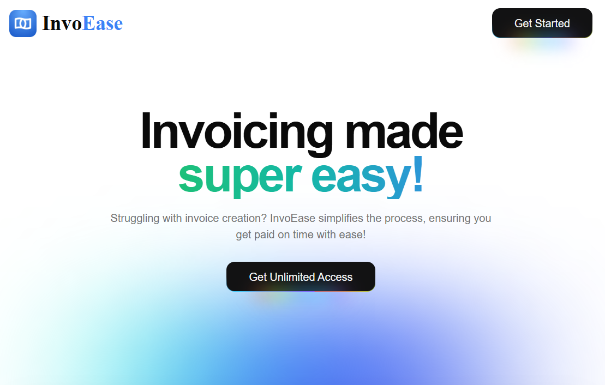
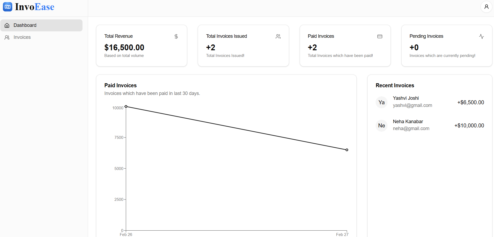
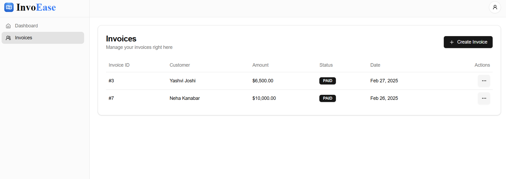

<h1 align="center">🧾 Invo <b>🅴 🅰 🆂 🅴</b>  - Simplifying Invoicing! </h1>

InvoEase is a powerful yet simple invoicing solution designed to help businesses and freelancers manage their invoices efficiently. With an intuitive interface and seamless workflow, InvoEase makes invoice creation and management effortless.

<h2> Why InvoEase?</h2>

📜 **Easy Invoice Creation** – Generate professional invoices in seconds 
📊 **Real-Time Insights** – Track outstanding and paid invoices easily 
🏦 **Multi-Currency Support** – Send invoices in multiple currencies 
🔒 **Secure and Reliable** – Industry-standard security for your data 
📤 **Export & Share** – Download invoices as PDFs and share via email.

<h2> Tech Stack</h2>

  
  
  
  
  

<h2> Preview</h2>

   
   
  

